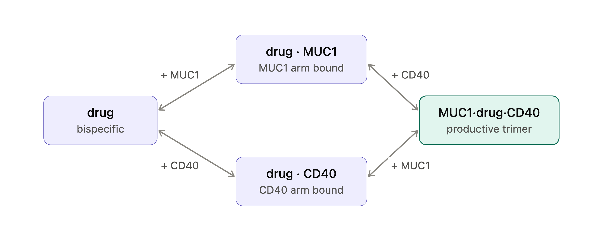
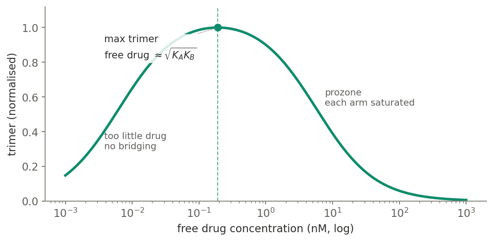
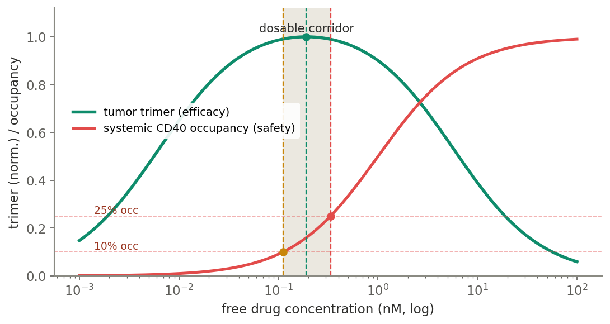
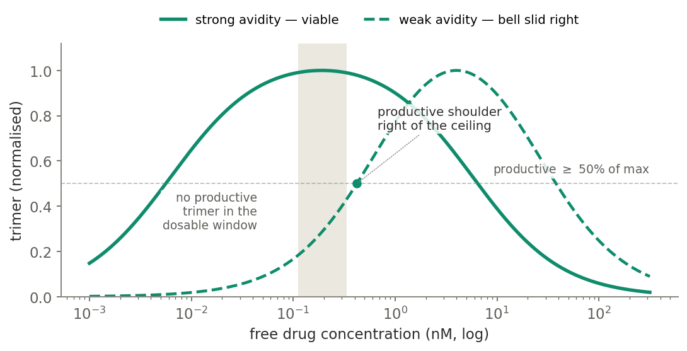
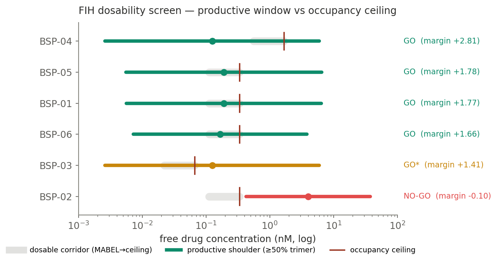

> **Disclaimer:** All datasets in this repository are simulated or 
> pseudodata generated solely for methodological demonstration purposes. 
> No proprietary, confidential, patient-derived, or employer-affiliated 
> data is included. This work represents independent research and 
> educational development conducted outside of any employment context 
> and does not reflect the proprietary methods, data, or intellectual 
> property of any employer or collaborator.
> 
> This repository is released under the [MIT License](LICENSE).
> © 2026 Bo Ma (tjmb03). Reuse with attribution.


# bispecific-fih-dosability

**A mechanistic first-in-human (FIH) dosability screen for tumor-targeted bispecific antibodies.**
Given a candidate's binding parameters, it answers a question you can ask *before any dose exists*:
does this molecule even have a dosable window — a concentration that is both **efficacious** and
**safe** — and if several candidates do, **which has the most margin?**

The worked example is an anti-MUC1 × CD40 T-cell–engaging / APC-agonist bispecific,
but the model is general to any bridging bispecific whose efficacy runs through a ternary complex and
whose safety runs through systemic agonist-receptor occupancy.

This is a companion to [`ocular-tmdd-format-selection`](https://github.com/tjmb03/ocular-tmdd-format-selection):
same theme — *use mechanism to select molecules* — a different modality and a different disposition problem.

---

## The problem

For a bridging bispecific, **efficacy is not monotonic in dose.** Signaling requires a *productive
ternary complex* — tumor antigen · drug · receptor. Too little drug and there is no bridging; too much
drug and each arm is saturated by its *own* drug molecule (the prozone / hook effect), so the trimer
collapses. Efficacy is therefore **bell-shaped**, and you dose *toward a window*, not toward the maximum.

The sharper point: **whether a usable window exists at all is a computable property of the molecule.**
Efficacy peaks at the tumor, where avidity stabilizes the trimer; the dose-limiting hazard (cytokine
release) is driven by **systemic, monovalent** receptor occupancy, which has no avidity benefit. If the
molecule's productive window sits to the *right* of the occupancy ceiling, **no dose is both efficacious
and safe** — and that verdict falls out of the binding parameters alone, before a single animal or patient.

## The model

<p align="center"></p>

At rapid-binding equilibrium with no inter-arm cooperativity (α = 1), the trimer is

```
[A·drug·B] = [drug] · [A_free] · [B_free] / (KA · KB)
```

with the free targets depleting as drug binds (solved by fixed-point iteration in
[`ternary.py`](src/bsdose/ternary.py)). Two results carry the whole model — and are pinned in the
[test-suite](tests/test_ternary.py):

1. **The trimer peaks at the geometric mean of the two arm KDs, `√(KA·KB)`** — exact in the target-excess
   limit and independent of how asymmetrically affinity is split between the arms. Only the *product* of
   the arm KDs sets the peak location.
2. **The peak height is capped by the limiting (scarcer) target.** Raising the abundant target yields
   diminishing returns toward a ceiling set by the scarcer one — so target *density* sets efficacy
   *magnitude*, separately from where the window sits.

<p align="center"></p>

## The decision rule

Efficacy is the **tumor trimer**, avidity-stabilized. Safety is **systemic CD40 occupancy**, a plain
monovalent one-site curve ([`corridor.py`](src/bsdose/corridor.py)) that defines a **dosable corridor**
between a MABEL floor (default 10% occupancy — the minimal-pharmacology start dose) and an occupancy
ceiling (default 25% — the CRS-risk limit). Crucially, both bounds move with the *monovalent* CD40 KD,
**not** the avidity-enhanced tumor KD.

<p align="center"></p>

A candidate is **dosable** exactly when a concentration exists that is at once productive
(tumor trimer ≥ 50% of its max, i.e. drug above the rising-shoulder onset `shoulder_lo`) and safe
(at or below the occupancy ceiling). That reduces to a single inequality
([`screen.py`](src/bsdose/screen.py)):

```
dosable  ⇔  shoulder_lo ≤ occupancy_ceiling
margin   =  log10( occupancy_ceiling / shoulder_lo )
```

Positive margin = dosable with headroom; negative = the productive window has slid right of the ceiling
and **no safe dose is efficacious.**

## Avidity is the lever

Ternary-complex avidity (the slowed apparent off-rate of the assembled trimer) is modeled as a
fold-tightening of the effective *tumor-arm* KDs, so the tumor optimum sits at `√(KA·KB) / avidity` —
higher avidity pulls the bell left, into the corridor. The systemic corridor gets no avidity benefit.
Weaken avidity and the **same molecule** slides its productive window right, out of the corridor:

<p align="center"></p>

This is why avidity, not the monomer affinities, is often the load-bearing design parameter — and why the
screen is worth running on a bivalent-vs-monovalent format decision.

## Results — screening a candidate panel

Six hypothetical candidates ([`data/candidates.csv`](data/candidates.csv)), each perturbing one lever,
run through `screen_candidate` and ranked by margin ([`examples/candidate_panel.py`](examples/candidate_panel.py)):

<p align="center"></p>

| candidate | KA / KB / avidity | tumor optimum | occupancy ceiling | margin (log₁₀) | verdict |
|-----------|-------------------|--------------:|------------------:|---------------:|---------|
| **BSP-04** | 0.2 / 5 / 8 | 0.125 nM | 1.67 nM | **+2.81** | GO — loose CD40 arm ⇒ widest corridor |
| **BSP-05** | 16 / 1 / 21 | 0.190 nM | 0.33 nM | **+1.78** | GO — but low CD40 density ⇒ weak efficacy magnitude |
| **BSP-01** | 16 / 1 / 21 | 0.190 nM | 0.33 nM | **+1.77** | GO — avidity-engineered lead, optimum in corridor |
| **BSP-06** | 1 / 1 / 6 | 0.167 nM | 0.33 nM | **+1.66** | GO — balanced, highest efficacy magnitude |
| **BSP-03** | 5 / 0.2 / 8 | 0.125 nM | 0.067 nM | **+1.41** | GO\* — tight CD40 arm drops the ceiling; dose to shoulder only |
| **BSP-02** | 16 / 1 / **1** | 3.996 nM | 0.33 nM | **−0.10** | **NO-GO** — avidity lost, window right of ceiling |

Three mechanistic reads the screen makes explicit:

- **BSP-01 vs BSP-02** — identical arms, avidity 21 → 1. Losing avidity moves the tumor optimum from
  0.19 nM (inside the corridor) to 4.0 nM (its productive shoulder now sits *right* of the 0.33 nM
  ceiling). **The bivalent format is a GO; the monovalent format of the same arms is a NO-GO.**
- **BSP-03 vs BSP-04** — mirror-image arm asymmetry with the *same* tumor potency, but the **CD40 arm
  affinity sets the systemic corridor**: a tight CD40 arm (BSP-03) collapses the ceiling to 0.067 nM and
  leaves only shoulder-dosing; a loose CD40 arm (BSP-04) opens the widest window of the panel.
- **BSP-05 vs BSP-01** — same scaffold, 10× lower tumor CD40 density. Still dosable, same optimum dose,
  but ~10× lower peak trimer: **density sets efficacy magnitude, not dosability.** Dosable ≠ efficacious.

## Reproduce

```bash
pip install -e .            # or: pip install -e ".[dev]" for the tests
python -m pytest -q         # 15 tests: the two model results + the decision rule
python -m bsdose.figures    # regenerate every figure in figures/ from the model
python examples/candidate_panel.py   # print the ranked table + rebuild the panel
```

Programmatic use:

```python
from bsdose import screen_candidate

r = screen_candidate("my-bsp", KA=16, KB=1, avidity=21, MUC1=5, CD40=0.5)
print(r.dosable, round(r.margin_log10, 2), r.verdict)
# True 1.77 GO: optimum reachable, comfortable margin
```

## Caveats (this is an illustrative screen, not a fitted model)

- **Rapid-binding equilibrium, no cooperativity (α = 1).** A full kinetic dual-target TMDD would add
  on/off rates, internalization, and turnover; the equilibrium form is deliberately the minimal object
  that makes the go/no-go computable.
- **Avidity is a lumped surrogate** — a fold-reduction in the effective tumor-arm KDs standing in for the
  ternary-complex apparent off-rate; it is not resolved into geometry or reach.
- **Systemic occupancy is a CRS surrogate.** The 10% / 25% thresholds are placeholders for a
  program-specific MABEL/safety analysis, not regulatory values.
- **Parameters are representative, not measured.** The candidate panel is synthetic and exists to exercise
  the levers (avidity, arm asymmetry, target density), not to describe any real molecule.

## Layout

```
src/bsdose/
  ternary.py     # trimer equilibrium; peak = √(KA·KB); height capped by limiting target
  corridor.py    # monovalent occupancy → MABEL floor / occupancy ceiling
  screen.py      # shoulder ∈ corridor → go/no-go + dosability margin
  figures.py     # regenerates all figures from the model
data/candidates.csv     # the candidate parameter table
examples/candidate_panel.py
figures/                # generated figures + the binding schematic
tests/                  # the model results and the decision rule, as assertions
```

## License

MIT © 2026 Bo Ma
